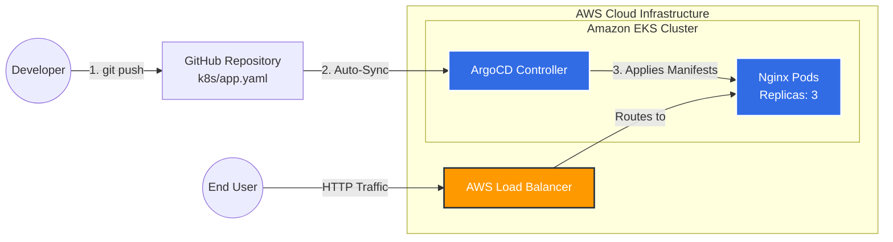
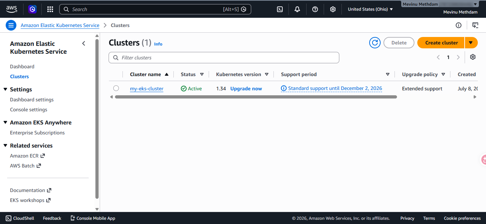
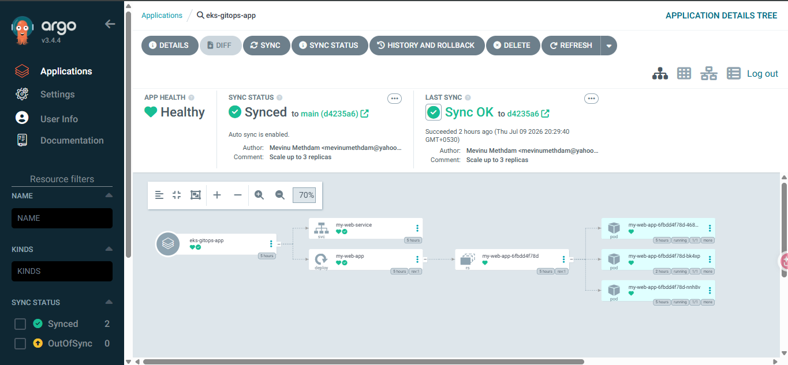
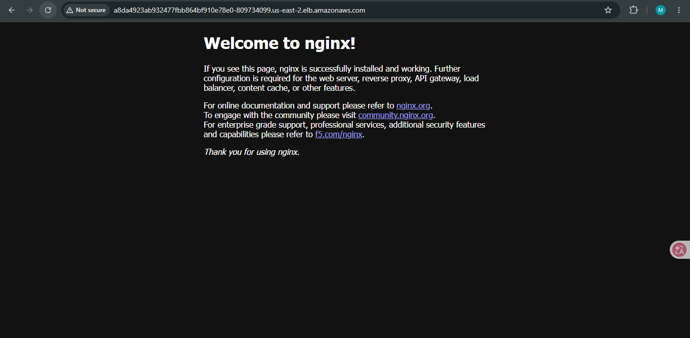

# AWS EKS GitOps Infrastructure with ArgoCD

## Project Overview
This project demonstrates a complete Cloud-Native deployment pipeline. It showcases the automated provisioning of an Amazon EKS (Elastic Kubernetes Service) cluster and the implementation of a continuous delivery (GitOps) workflow using ArgoCD. 

Instead of manually configuring servers, this project proves the ability to manage cloud infrastructure and application deployments entirely through code.

## Tech Stack & Tools
* **Cloud Provider:** AWS (Amazon Web Services)
* **Infrastructure Provisioning:** `eksctl` (AWS CloudFormation)
* **Container Orchestration:** Kubernetes (Amazon EKS)
* **GitOps Automation:** ArgoCD
* **Version Control:** GitHub

## Architecture & Workflow
1. **Infrastructure as Code:** Provisioned a highly available EKS cluster (`t3.small` nodes) across multiple availability zones in `us-east-2` using `eksctl`.
2. **GitOps Implementation:** Deployed ArgoCD into the cluster to monitor this GitHub repository.
3. **Automated Deployment:** Any modifications to the Kubernetes manifests (`k8s/app.yaml`) are automatically detected and synchronized to the AWS cluster by ArgoCD, achieving a true GitOps pipeline without manual `kubectl` interventions.

## System Architecture

This diagram illustrates the GitOps workflow and the AWS EKS infrastructure implemented in this project.

## Proof of Concept

### 1. AWS Infrastructure Deployment

Successfully deployed the EKS Cluster and underlying Node Groups via CloudFormation.

### 2. GitOps Automation (ArgoCD)

ArgoCD dashboard successfully syncing the GitHub repository to the EKS cluster.

### 3. Live Application

The Nginx deployment successfully exposed to the internet via an AWS Classic Load Balancer.

---
*Developed by Mevinu Methdam*
